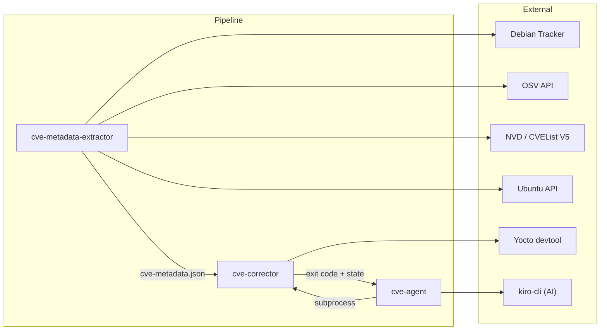
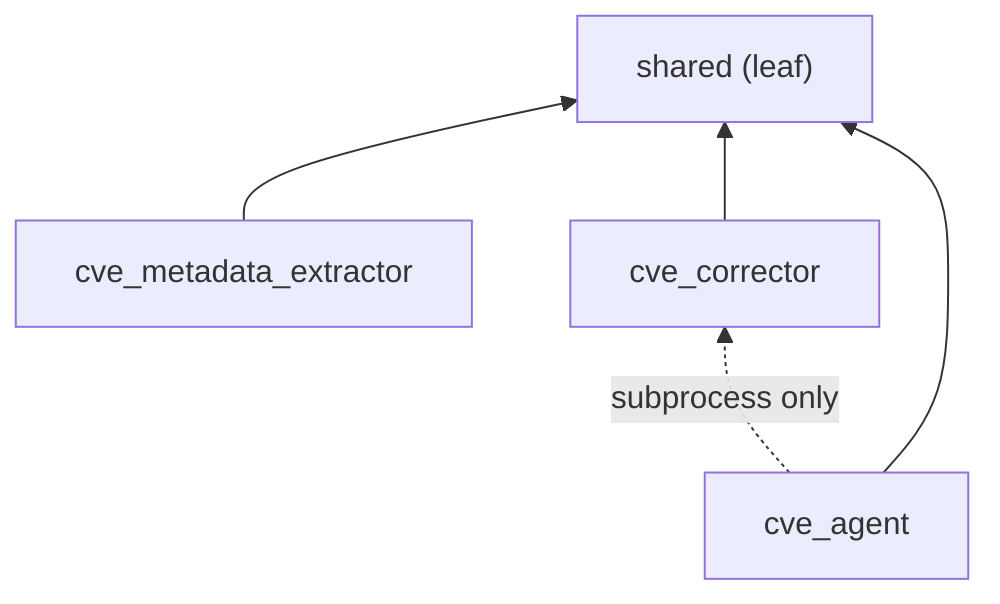
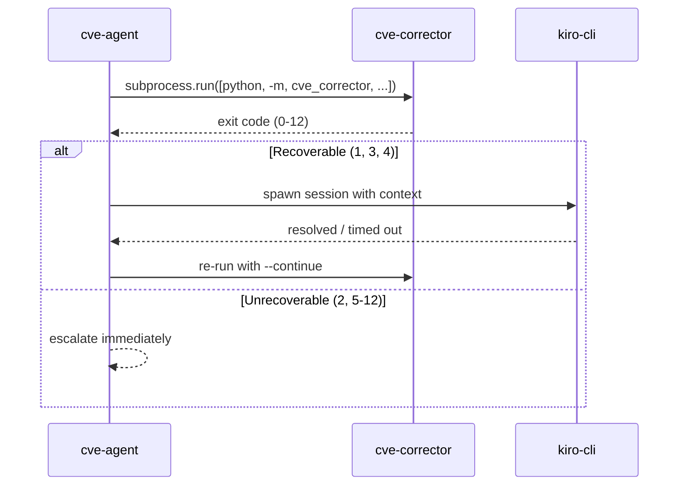
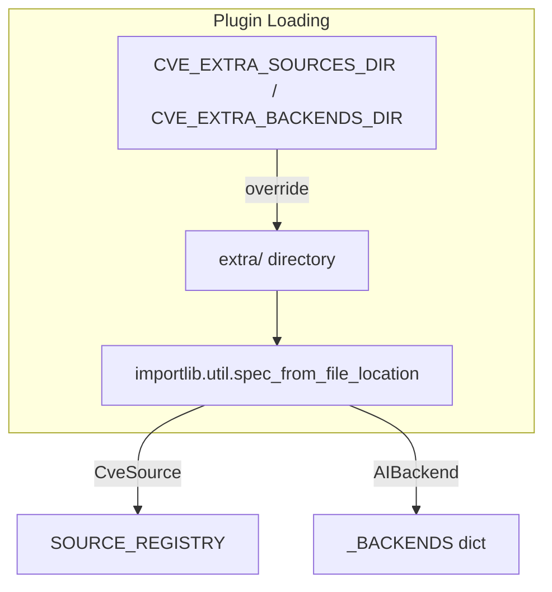
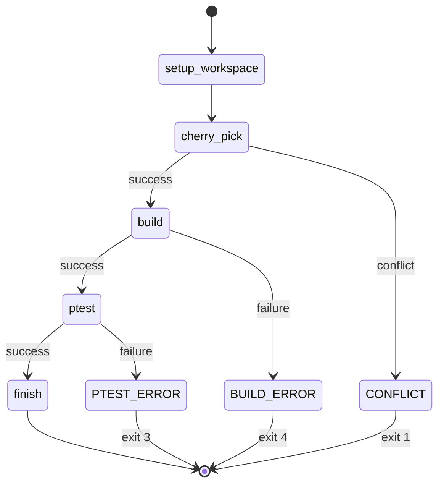
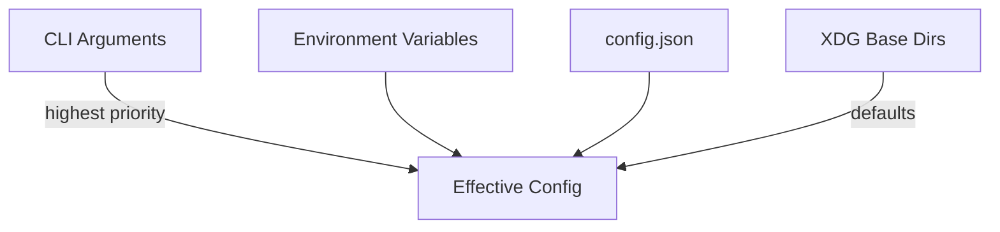

# Architecture

## System Overview

## Dependency Graph (Internal)

**Invariant**: `shared` has zero upward dependencies. No package imports from a sibling package at the Python level. The agent invokes the corrector only via `subprocess.run()`.

## Process Isolation

The agent and corrector run in separate processes:

This design ensures:
- Corrector crashes don't take down the agent
- AI sessions operate in an isolated git workspace
- State is persisted to disk between invocations (resume after interruption)

## Plugin System

Both the extractor and agent support runtime plugin discovery:

**Security controls**:
- Directory must be owned by current user (`st_uid == os.getuid()`)
- Directory must not be world-writable (`st_mode & 0o002 == 0`)
- Files starting with `_` are skipped
- Load errors are caught and logged (no crash)
- Backend loader additionally rejects symlinks and world-writable files

## State Management

The corrector uses a serializable `WorkflowState` dataclass persisted as JSON:

State files are written atomically (`tempfile` + `os.replace`) to the build directory's state dir.

## Security Architecture

| Boundary | Mechanism |
|----------|-----------|
| Git subprocess env | `GIT_ENV_ALLOWLIST` — only safe vars passed through |
| Plugin loading | Ownership + permission checks before `exec_module` |
| AI file scope | Pre-commit hook restricts which files AI can modify |
| Secrets | Never passed to git env; `GITHUB_TOKEN` used only in HTTP requests |
| Atomic writes | State files use `tempfile` + `os.replace` to prevent corruption |

## Configuration Hierarchy

Priority: CLI args > environment variables > config.json > XDG defaults.
