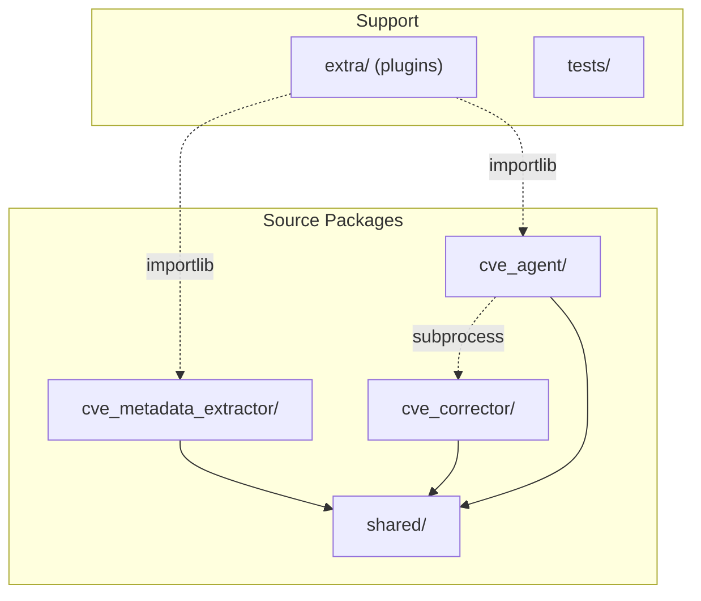

# Codebase Information

## Project Identity

- **Name**: yocto-security-tools
- **Version**: 1.0.0
- **License**: MIT (Ericsson AB)
- **Repository**: https://github.com/Ericsson/yocto-security-tools
- **Language**: Python 3.9+
- **Build System**: setuptools (pyproject.toml)

## Purpose

Standalone CVE management tools for Yocto/OpenEmbedded Linux distributions. The toolchain automates the process of finding CVE fix commits, backporting them to stable Yocto recipes via devtool, and resolving conflicts with AI assistance.

## Package Structure

## CLI Entry Points

| Command | Module | Purpose |
|---------|--------|---------|
| `cve-metadata-extractor` | `cve_metadata_extractor.__main__:main` | Find fix commits from public sources |
| `cve-corrector` | `cve_corrector.__main__:main` | Apply CVE patches via devtool |
| `cve-agent` | `cve_agent.__main__:main` | AI-orchestrated conflict resolution |

## Technology Stack

| Layer | Technology |
|-------|-----------|
| Language | Python 3.9, 3.10, 3.11, 3.12 |
| Runtime deps | `requests` (HTTP), `packaging` (version parsing) |
| Dev deps | `pytest`, `pytest-cov`, `mypy`, `ruff` |
| Build | setuptools ≥68.0 |
| CI | GitHub Actions (matrix across Python versions) |
| Pre-commit | ruff (lint+format), mypy |
| Type checking | mypy (check_untyped_defs, ignore_missing_imports) |
| Linting | ruff (E, F, W, I, UP, B, SIM rules, 100 char line) |

## Storage Model

XDG Base Directory compliant with environment variable overrides:

| Purpose | Default Path | Override |
|---------|-------------|----------|
| Persistent data | `~/.local/share/yocto-security-tools/` | `CVE_TOOLS_DATA_DIR` |
| Cache | `~/.cache/yocto-security-tools/` | `CVE_TOOLS_CACHE_DIR` |

## Test Organization

Tests mirror the source package structure:
- `tests/agent/` — cve_agent tests
- `tests/corrector/` — cve_corrector tests
- `tests/extractor/` — cve_metadata_extractor tests
- `tests/shared/` — shared module tests
- `tests/integration/` — end-to-end tests (shell + Python)

Coverage threshold: 75% (enforced in CI).
