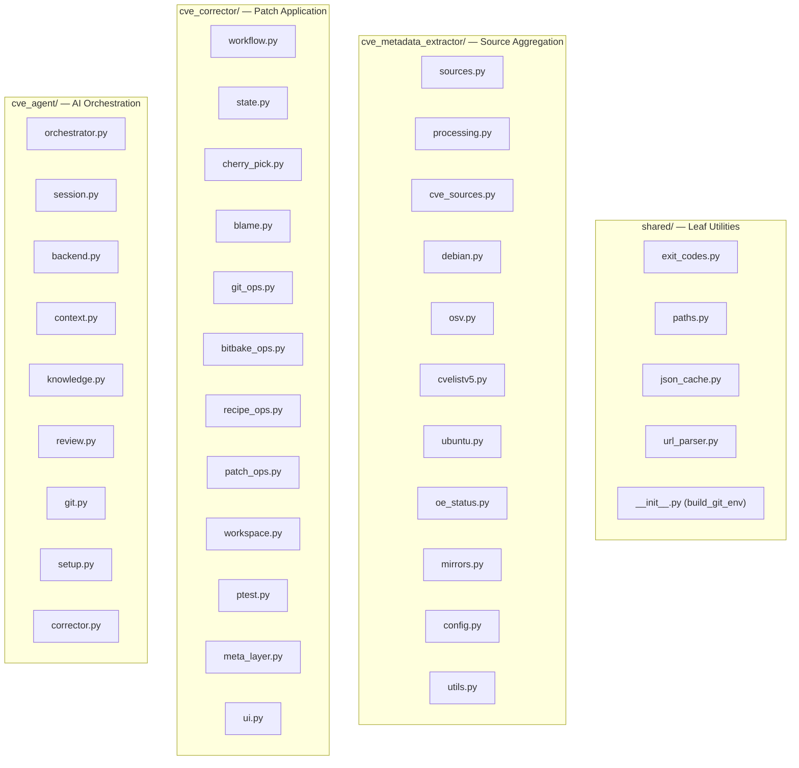

# Components

## Package Map

## shared/

| File | Responsibility |
|------|---------------|
| `exit_codes.py` | Single source of truth for all exit codes (0–15) |
| `paths.py` | XDG-compliant `data_dir()` and `cache_dir()` with env overrides |
| `json_cache.py` | Gzip-compressed JSON cache with atomic writes (`cache_load`, `cache_dump`) |
| `url_parser.py` | Parse GitHub/GitLab commit URLs, extract hashes, fetch PR commit lists |
| `__init__.py` | `GIT_ENV_ALLOWLIST` and `build_git_env()` for safe subprocess environments |

## cve_metadata_extractor/

| File | Responsibility |
|------|---------------|
| `sources.py` | `CveSource` base class, `SOURCE_REGISTRY`, plugin auto-discovery |
| `processing.py` | `process_cve()` — orchestrates extraction across all enabled sources |
| `cve_sources.py` | `load_cves_from_sources()` — reads cve-summary.json or VEX input |
| `debian.py` | Debian Security Tracker: DSA parsing, patch extraction from .debian.tar |
| `osv.py` | OSV API: query by CVE, extract fix commits and references |
| `cvelistv5.py` | CVEList V5 + NVD: local git clone, JSON parsing, reference extraction |
| `ubuntu.py` | Ubuntu Security API: CVE lookup, patch URL extraction |
| `oe_status.py` | Check if CVE is already fixed in OE branches (git log search) |
| `mirrors.py` | Create/update local git mirrors of upstream source repos |
| `config.py` | Load config.json with XDG path resolution and caching |
| `utils.py` | Shared utilities: hash regex, PR cache, deduplication, URL patterns |
| `__main__.py` | CLI entry point: argument parsing, batch processing, summary output |

## cve_corrector/

| File | Responsibility |
|------|---------------|
| `workflow.py` | Main state machine: `initialize_cve_workflow()`, `finish_cve_workflow()`, build/ptest steps |
| `state.py` | `WorkflowState` dataclass, exception hierarchy, state persistence |
| `cherry_pick.py` | Cherry-pick strategies: single commit, series, least-conflict selection |
| `blame.py` | `git blame` analysis to determine if CVE is applicable to recipe version |
| `git_ops.py` | Git operations: checkout, tag matching, monorepo detection, strip level |
| `bitbake_ops.py` | BitBake integration: meta-layer resolution, mirror lookup, workspace cleanup |
| `recipe_ops.py` | Recipe file manipulation: SRC_URI patching, bbappend handling, patch naming |
| `patch_ops.py` | Patch file operations: metadata insertion, patch modification |
| `workspace.py` | devtool workspace setup: `setup_devtool_workspace()`, upstream remote, CVE branch |
| `ptest.py` | ptest execution: enable ptest, run tests, compare before/after results |
| `meta_layer.py` | Meta-layer commit creation: CVE status writing, patch export |
| `ui.py` | Terminal UI: conflict/edit/manual instruction display |
| `__main__.py` | CLI entry point: argument parsing, bitbake env validation, interrupt handling |
| `version.py` | PEP 440-compatible version comparison for tag matching |

## cve_agent/

| File | Responsibility |
|------|---------------|
| `orchestrator.py` | Resolution loop: run corrector → evaluate exit → spawn AI → retry |
| `session.py` | Guarded AI sessions: scope enforcement, audit logging, deviation tracking |
| `backend.py` | `AIBackend` interface, `KiroBackend` implementation, plugin discovery |
| `context.py` | Build AI prompt context: conflict details, build logs, ptest results, knowledge |
| `knowledge.py` | `KnowledgeBase` class: store/retrieve resolution patterns with file-locking |
| `review.py` | Post-resolution review: diff display, commit amendment, approval workflow |
| `git.py` | Agent-specific git ops: scope hook, unauthorized change revert, env filtering |
| `setup.py` | Agent installation: verify kiro-cli, install agent definitions |
| `corrector.py` | Thin wrapper: validate inputs, invoke `cve_corrector` subprocess |
| `__init__.py` | Package constants: `AgentConfig`, `CveResult`, `ResultStatus`, exit code re-exports |
| `AGENT_INSTRUCTIONS.md` | Prompt template for AI sessions (scope rules, workflow, resolution principles) |
| `agents/*.json` | kiro-cli agent definition files (interactive and non-interactive) |

## extra/

Plugin directory (`.gitignore`'d). Contains symlinks to private plugins. Auto-discovered at runtime by both extractor (`CveSource`) and agent (`AIBackend`).

## tests/

| Directory | Coverage |
|-----------|----------|
| `tests/agent/` | Orchestration, session, backend, context, knowledge, review, git, security |
| `tests/corrector/` | Workflow, cherry-pick, blame, git ops, recipe ops, state, ptest, monorepo |
| `tests/extractor/` | Each source (debian, osv, cvelistv5, ubuntu), processing, utils |
| `tests/shared/` | URL parser, conftest fixtures |
| `tests/integration/` | Shell-based end-to-end tests with real git repos |
| `tests/conftest.py` | Shared fixtures: mock bitbake env, workspace/repo factories |
| `tests/helpers.py` | Test utilities: workflow runner, patch assertion helpers |
