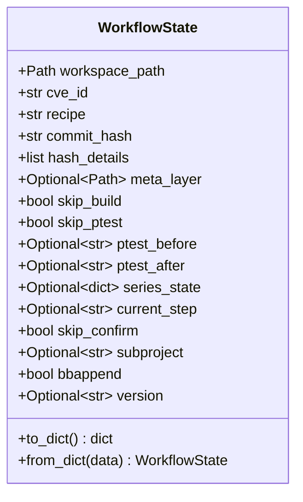
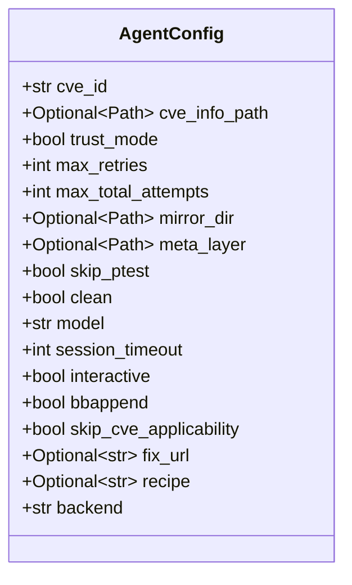
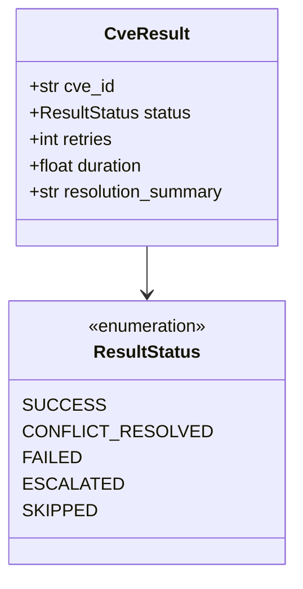
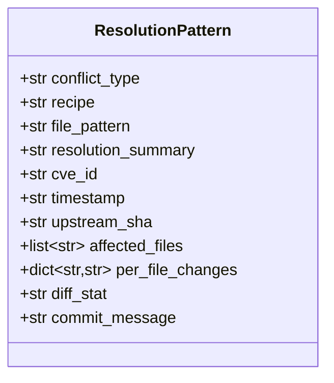
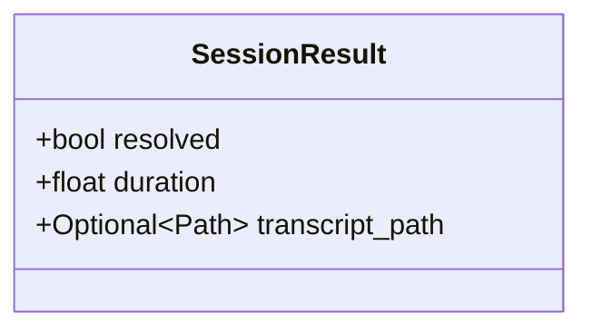
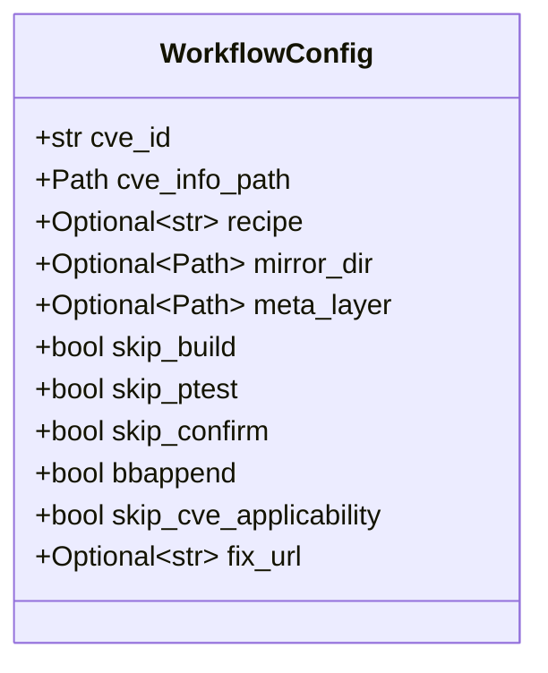
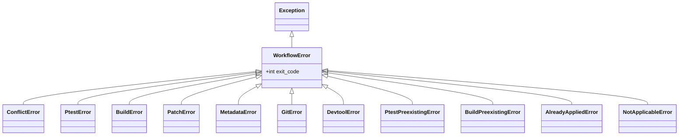

# Data Models

## Core Dataclasses

### WorkflowState (cve_corrector/state.py)

Serializable state for the corrector's workflow, enabling resume after interruption.



**Persistence**: JSON file at `<state_dir>/<recipe>.json`, written atomically via `tempfile` + `os.replace`.

### AgentConfig (cve_agent/__init__.py)

Configuration for a single CVE agent run.



### CveResult (cve_agent/__init__.py)

Outcome of processing a single CVE.



### ResolutionPattern (cve_agent/knowledge.py)

A recorded conflict resolution pattern for the knowledge base.



### SessionResult (cve_agent/backend.py)



### WorkflowConfig (cve_corrector/workflow.py)



## Enumerations

### ResultStatus (cve_agent/__init__.py)

| Value | Meaning |
|-------|---------|
| `SUCCESS` | CVE fixed on first attempt (clean cherry-pick) |
| `CONFLICT_RESOLVED` | Fixed after AI-assisted conflict resolution |
| `FAILED` | All retries exhausted |
| `ESCALATED` | Unrecoverable error, requires human intervention |
| `SKIPPED` | CVE already applied or not applicable |

### Exit Codes (shared/exit_codes.py)

| Code | Constant | Category | Meaning |
|------|----------|----------|---------|
| 0 | `EXIT_SUCCESS` | Success | Workflow completed |
| 1 | `EXIT_CONFLICT` | Recoverable | Cherry-pick conflict |
| 2 | `EXIT_CHECKOUT_ERROR` | Unrecoverable | Version checkout failed |
| 3 | `EXIT_PTEST_ERROR` | Recoverable | Post-patch ptest failure |
| 4 | `EXIT_BUILD_ERROR` | Recoverable | Post-patch build failure |
| 5 | `EXIT_PATCH_ERROR` | Unrecoverable | Patch generation error |
| 6 | `EXIT_METADATA_ERROR` | Unrecoverable | Bad metadata/config |
| 7 | `EXIT_GIT_ERROR` | Unrecoverable | Git operation failed |
| 8 | `EXIT_PTEST_PREEXISTING` | Unrecoverable | Ptest already failing |
| 9 | `EXIT_DEVTOOL_ERROR` | Unrecoverable | Devtool operation failed |
| 10 | `EXIT_BUILD_PREEXISTING` | Unrecoverable | Build already failing |
| 11 | `EXIT_ALREADY_APPLIED` | Unrecoverable | Fix already present |
| 12 | `EXIT_NOT_APPLICABLE` | Unrecoverable | Vulnerable code absent |
| 13 | `EXIT_TRUST_DECLINED` | Agent | User declined trust mode |
| 14 | `EXIT_AGENT_ERROR` | Agent | Internal agent error |
| 15 | `EXIT_AI_TIMEOUT` | Agent | AI session timed out |

## Exception Hierarchy



Each exception maps to a specific exit code. The corrector's `__main__.py` catches `WorkflowError` and returns `e.exit_code`.

## JSON Schemas

### cve-metadata.json

Top-level dict keyed by CVE ID:

```json
{
  "CVE-YYYY-NNNN": {
    "name": "string (component/recipe name)",
    "hashes": ["string (commit SHA)"],
    "hash_details": [
      {"hash": "string", "url": "string", "source": "string"}
    ],
    "series": [
      {"pull_url": "string", "commits": ["string"]}
    ],
    "patches": [
      {"url": "string", "tags": "string"}
    ],
    "references": ["string (URL)"],
    "oe_status": "string (optional, e.g. 'fixed-in-scarthgap')"
  }
}
```

### knowledge.json

Array of `ResolutionPattern` objects (see dataclass above). File-locked with `fcntl.flock` for concurrent access safety.

### conclusion.json (AI Output)

Written by AI when CVE is not applicable:

```json
{
  "not_applicable": true,
  "reason": "string (specific explanation)"
}
```

### config.json (Extractor Configuration)

```json
{
  "cvelistv5_url": "string (git URL)",
  "cvelistv5_branch": "string",
  "debian_release": "string",
  "debian_tracker_url": "string (git URL)",
  "debian_tracker_branch": "string",
  "nvd_url": "string (git URL)",
  "nvd_branch": "string",
  "oe_branches": ["string"],
  "osv_api": "string (base URL)",
  "ubuntu_api": "string (base URL)",
  "snapshot_api": "string (base URL)"
}
```
