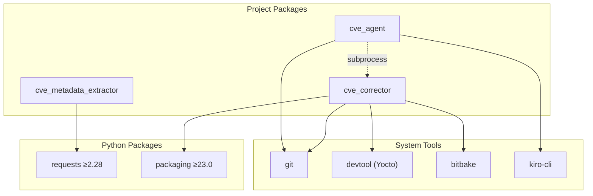

# Dependencies

## Runtime Dependencies

| Package | Version Constraint | Purpose | Used By |
|---------|-------------------|---------|---------|
| `requests` | ≥2.28, <3 | HTTP client for CVE source APIs | cve_metadata_extractor (OSV, Ubuntu, Debian snapshot, GitHub PR) |
| `packaging` | ≥23.0, <27 | PEP 440 version parsing and comparison | cve_corrector (tag matching via `Version` class) |

**Design principle**: Only two runtime dependencies. The project intentionally avoids adding more — standard library is preferred for anything achievable without external packages.

## Development Dependencies

| Package | Version Constraint | Purpose |
|---------|-------------------|---------|
| `pytest` | ≥7.0, <10 | Test framework |
| `pytest-cov` | ≥4.0, <8 | Coverage reporting (threshold: 75%) |
| `mypy` | ≥1.8, <3 | Static type checking |
| `ruff` | ≥0.4, <1 | Linting and formatting |
| `types-requests` | (latest) | Type stubs for mypy (via pre-commit) |

## System Dependencies

| Tool | Required By | Purpose |
|------|-------------|---------|
| Python 3.9+ | all | Runtime |
| Git | all | Repository operations, cherry-pick, blame |
| devtool | cve_corrector, cve_agent | Yocto recipe workspace management |
| bitbake | cve_corrector, cve_agent | Build system (via `BBPATH` env) |
| kiro-cli | cve_agent (default backend) | AI session execution |

## External Services

| Service | URL | Used By | Auth |
|---------|-----|---------|------|
| GitHub API | api.github.com | extractor (PR commits) | `GITHUB_TOKEN` |
| OSV API | api.osv.dev | extractor | None |
| Ubuntu Security | ubuntu.com | extractor | None |
| Debian Snapshot | snapshot.debian.org | extractor | None |
| OE Mailing List | (configurable) | extractor | `OPENEMBEDDED_TOKEN` |

## Git Repository Dependencies

Cloned locally to `data_dir()/repos/` or shared XDG data locations:

| Repository | Config Key | Purpose |
|-----------|-----------|---------|
| CVEList V5 | `cvelistv5_url` | CVE JSON records |
| Debian Security Tracker | `debian_tracker_url` | DSA/CVE mapping, patch references |
| NVD Data Feeds | `nvd_url` | NVD vulnerability records |

## Dependency Graph

## Version Constraints Rationale

| Constraint | Reason |
|-----------|--------|
| `requests>=2.28,<3` | 2.28 introduced `json` param improvements; <3 avoids breaking API changes |
| `packaging>=23.0,<27` | 23.0 dropped legacy version parsing; upper bound for stability |
| `python>=3.9` | Uses `dict` union operator, `str.removeprefix()`, type hints without `__future__` |

## Build System

| Tool | Version | Purpose |
|------|---------|---------|
| setuptools | ≥68.0 | Package building (PEP 517 backend) |

Build configuration is entirely in `pyproject.toml` — no `setup.py` or `setup.cfg`.

## Pre-commit Hooks

| Hook | Source | Version |
|------|--------|---------|
| ruff (lint + format) | `astral-sh/ruff-pre-commit` | v0.15.14 |
| mypy | `pre-commit/mirrors-mypy` | v2.1.0 |

## CI Matrix

GitHub Actions runs on `ubuntu-latest` across Python 3.9, 3.10, 3.11, 3.12 with:
1. `ruff check .`
2. `mypy cve_agent cve_corrector cve_metadata_extractor shared`
3. `pytest --cov --cov-report=term-missing`
