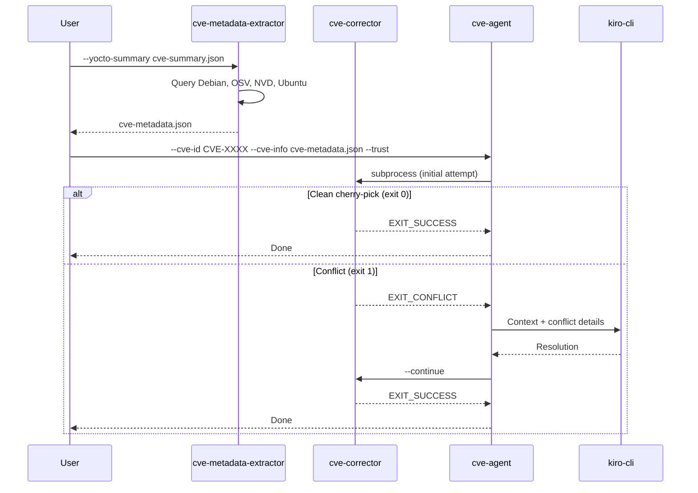
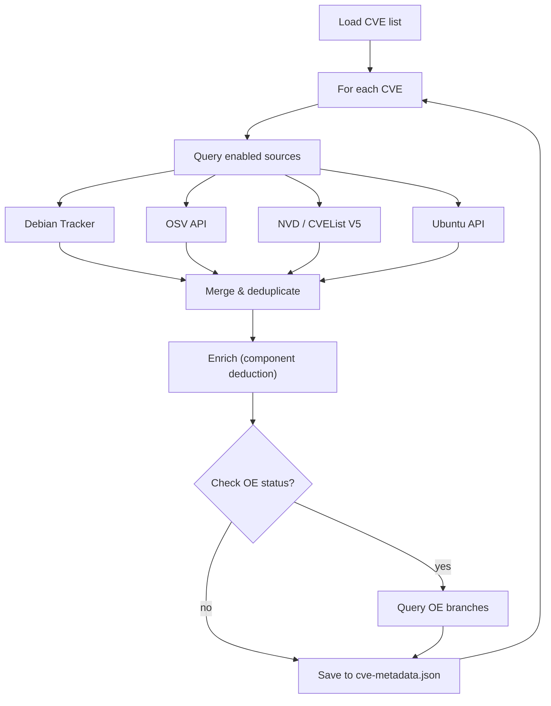
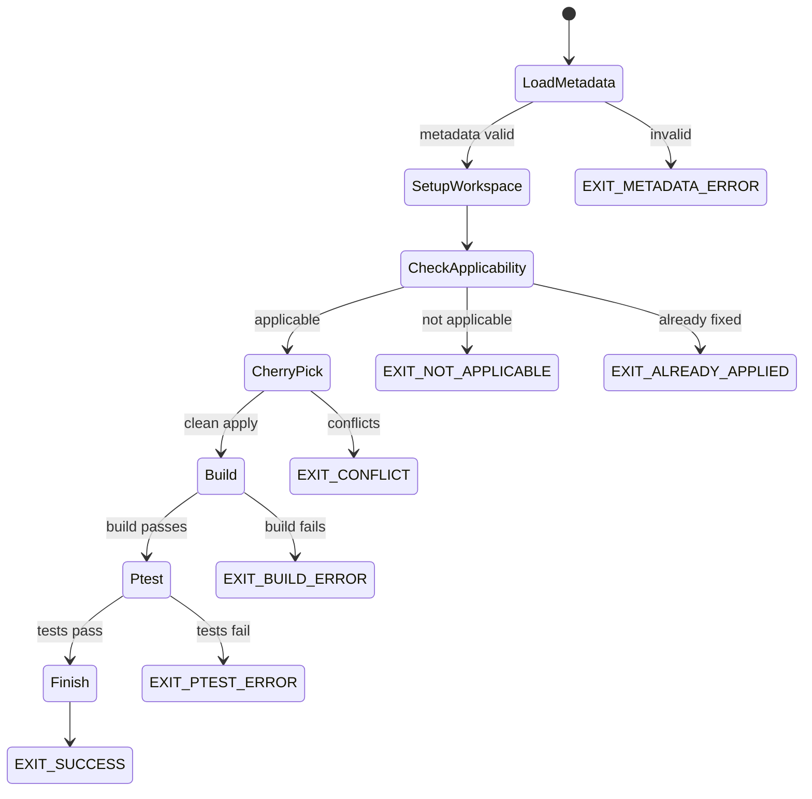
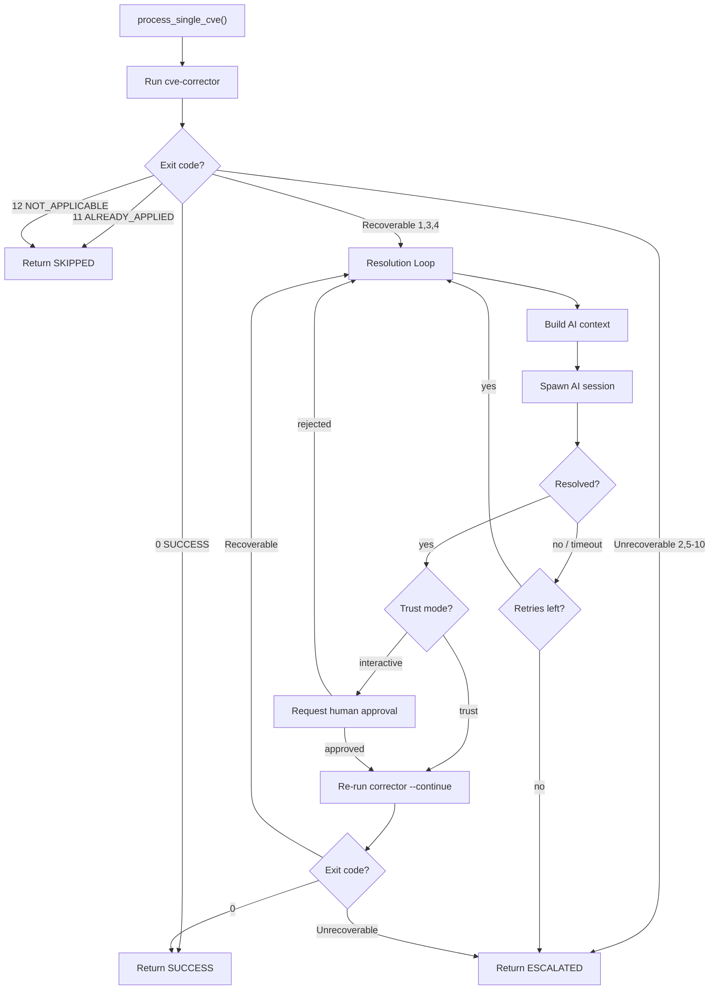
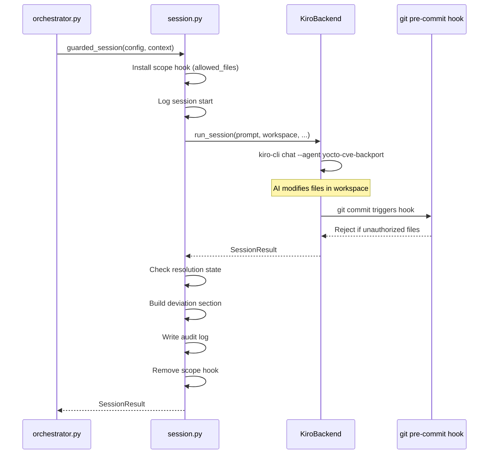
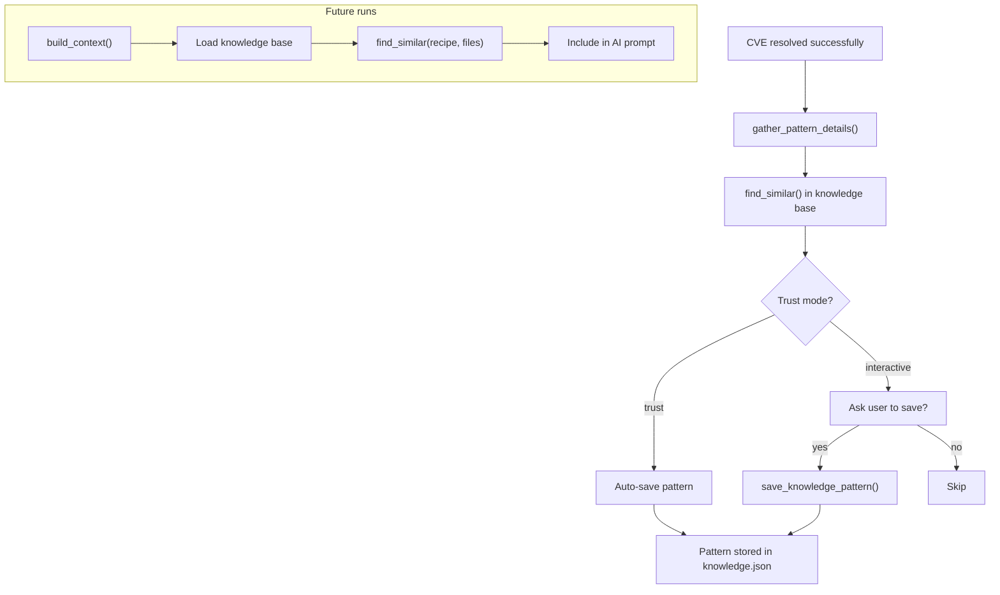
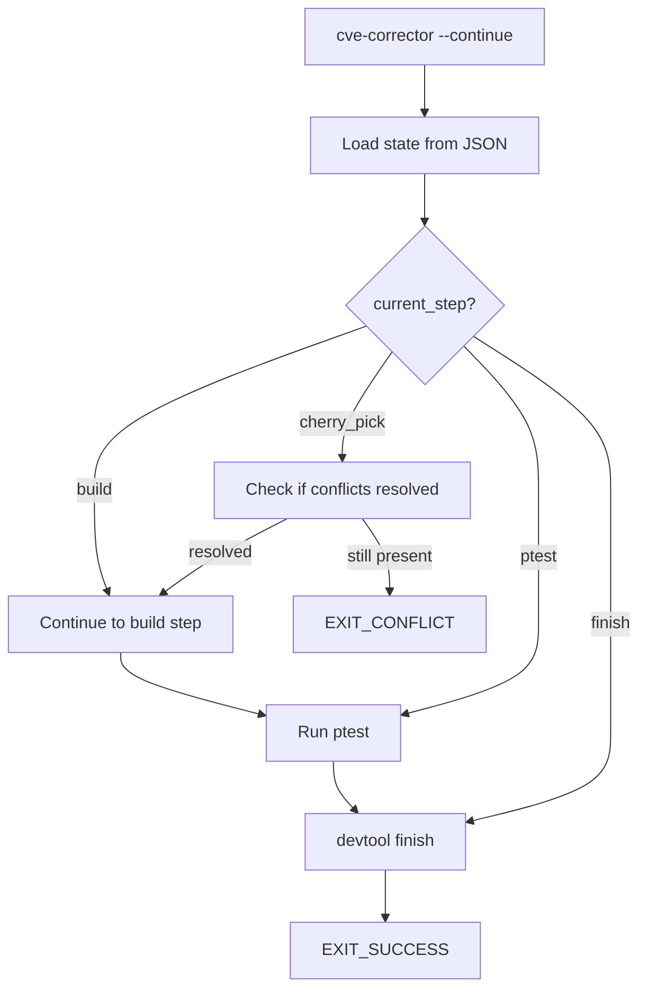
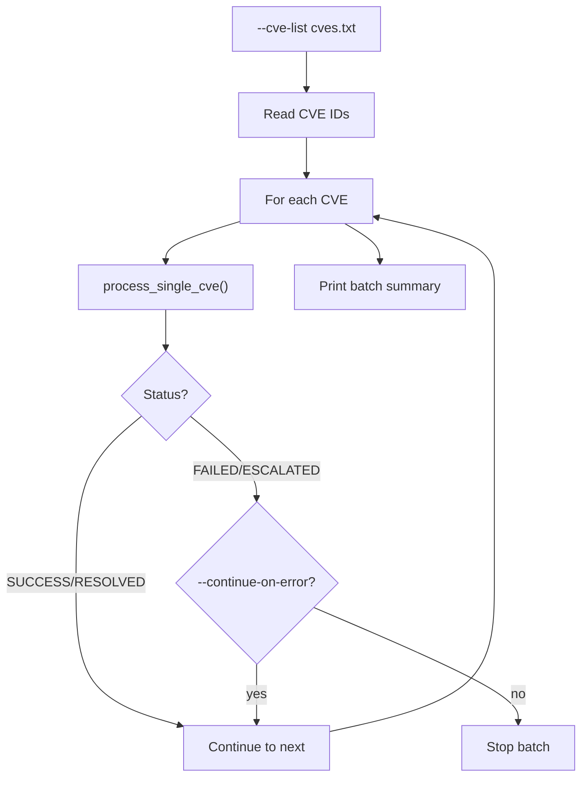

# Workflows

## End-to-End Pipeline

## Metadata Extraction Workflow

**Key behaviors**:
- Sources run in registration order; results are merged
- Hash deduplication by commit SHA
- Component name deduced from source data or `--cve-component-name` override
- OE status check is optional (`--check-oe-status` flag)

## Corrector Workflow (State Machine)

### Corrector Steps Detail

1. **LoadMetadata**: Read `cve-metadata.json`, validate CVE entry exists
2. **SetupWorkspace**: `devtool modify <recipe>`, setup upstream remote, create CVE branch
3. **CheckApplicability**: `git blame` analysis to verify vulnerable code exists in recipe version
4. **CherryPick**: Try strategies in order:
   - Single commit cherry-pick
   - Series application (if `series` data available)
   - Least-conflict commit selection (if multiple hashes)
5. **Build**: `devtool build <recipe>` (skippable with `--skip-build`)
6. **Ptest**: Enable ptest, run before/after comparison (skippable)
7. **Finish**: `devtool finish`, update recipe SRC_URI, create meta-layer commit

## Agent Orchestration Loop

## AI Session Workflow

## Knowledge Base Workflow

## Resume (--continue) Workflow

## Batch Processing (Agent)

